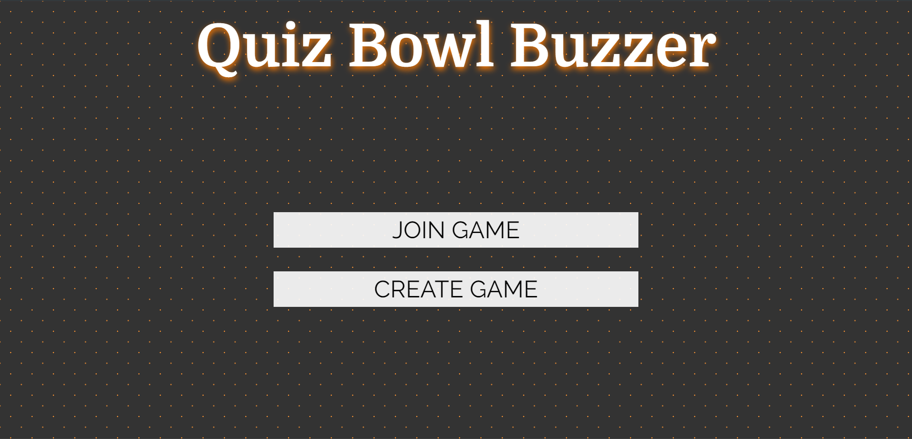

# QuizBowlWebsite

Welcome to QuizBowlWebsite, a buzzer app designed for running quiz bowl rounds in the style of [Commissioner's Academic Challenge](https://en.wikipedia.org/wiki/Commissioner's_Academic_Challenge#Tournament_Format).

## Getting Started

To run the application locally, follow these steps:

1. Clone this repository using Git:
   ```bash
   git clone https://github.com/stevesajeev1/QuizBowlWebsite.git
   ```

2. Install [Node.js](https://nodejs.org).

3. Navigate to the project directory and install the required dependencies:
   ```bash
   cd QuizBowlWebsite
   npm install
   ```

4. Create an application on [Pusher](https://pusher.com/channels/). After creating the app, copy the following information into a `.env.local` file in your project's root directory:

   ```env
   PUSHER_APP_ID=
   PUSHER_SECRET=
   PUSHER_APP_KEY=
   PUSHER_CLUSTER_REGION=
   ```

   > Remember to update the `PUSHER_APP_KEY` and `PUSHER_CLUSTER_REGION` variables in the `public/pusher.js` file.

5. Make sure to enable "**Enable client events**" in the Pusher application settings.

## Technologies Used

This app was built using [Next.js](https://nextjs.org/) and is deployed on [Vercel](https://vercel.com/).

## How to Use

The app is currently live at [QuizBowlWebsite](https://quiz-bowl-website.vercel.app/). Here's how to use it:

1. **Homepage**:
   - Visit the homepage to either join an existing game or create a new one.

   

2. **Join a Game**:
   - To join a game, enter a join code and a nickname of your choice.

   

3. **Create a Game**:
   - To create a game, simply enter a join code.

   

4. **Player View**:
   - Once in the game, participants can view the round, teams, scores, and a timer.

   

5. **Host View**:
   - The host can select the round, manage teams and their scores, and control the timer.

   

Feel free to contribute, report issues, or provide feedback to help us improve QuizBowlWebsite. Enjoy your quiz bowl experience!